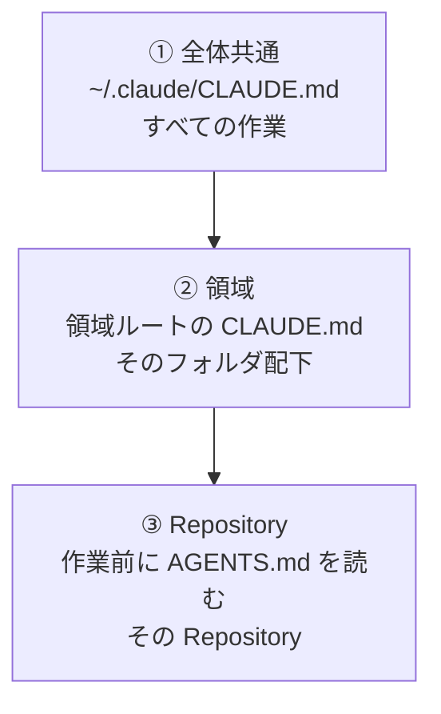

<!-- Document Info（文書情報） -->
| Item（項目） | Value（値） |
|---|---|
| Document ID（文書ID） | STD-PERSONA-REFERENCE-CLAUDE-CODE-SETUP-001 |
| Version（バージョン） | 1.0 |
| Status（ステータス） | Approved |
| Created Date（作成日） | 2026-10-03 |
| Last Updated（最終更新日） | 2026-10-03 |
| Owner（管理者） | t-oikawa-sendai |
| Related Documents（関連文書） | [`../README.md`](../README.md)<br>[`../CLAUDE_PERSONA.md`](../CLAUDE_PERSONA.md)<br>[`../PERSONA_OPERATION_CASE_STUDY.md`](../PERSONA_OPERATION_CASE_STUDY.md)<br>[`../../../README.md`](../../../README.md) |

---

# Claude Code Setup（Claude Code設定）

## 1. Purpose（目的）

この文書は、職業訓練校でIT教育を担当する **O講師** が、Claude Desktop の Codeタブで使っている `CLAUDE.md` の3層構成と、その利用環境を示す Reference 用の設定資料です。

Web版の Project で Persona を使い分けている利用者が、Claude Code で同じ考え方の常時指示を置くときの参考にします。

ここで示す構成は唯一の手順ではありません。利用者の目的、アカウント、作業フォルダに合わせて採否を判断してください。Education用4Gem＋1の現行手順として流用しないでください。

公式仕様の確認日は **2026-10-03** です。確認したページは §3.4 にまとめます。確認できなかった事項は本文で `UNVERIFIED` と記します。

`~` は、その利用者のホームディレクトリ（`/Users/【ユーザー名】`）を指します。

---

## 2. Claude Desktopの画面と設定の対応

確認日時点の Claude Desktop 公式では、画面は **Chat**、**Cowork**、**Code** の3タブと案内されています。Codeタブは、作業するフォルダを選び、そのフォルダのファイルを読んで変更する画面です。Desktop の Codeタブと Claude Code CLI は別のセッション履歴を持ち、`CLAUDE.md` などの設定は共有します。

Help Center では、Pro / Max 向けに Chat と Cowork の切替が無くなる新しい体験が段階的に展開中である、とも案内されています。タブの名前は変わり得ます。この資料が対応づけるのは、会話用の Chat と、ローカルファイルを扱う Code です。

### 2.1 Chatタブと Codeタブ

| 画面 | 常時の指示を置く場所 | 効く単位 | ファイルの扱い |
|---|---|---|---|
| Chatタブ | Project のプロジェクト指示とナレッジ | Project | ナレッジとして追加した資料を、その Project のチャットで使う |
| Codeタブ | 作業フォルダと、その親にある `CLAUDE.md` | 作業フォルダ | 選んだフォルダのファイルを Claude 自身が作成・編集する |

Chatタブの Project は、プロジェクト指示とナレッジを持つ作業場です。Help Center は、Project がすべての画面で使え、Project からチャットを開始できると記載しています。本資料では、同一アカウントの Web版 Project と Desktop の Chat 側 Project を、このアカウント共有の Project として扱います。

ローカルフォルダに結び付いた Project は、Desktop 上の Cowork セッションに限る、という例外が Help Center にあります。すべての Project が Web と Desktop で同じ動きをする、とまでは記載されていません。

Codeタブは Web版 Project を開く画面ではありません。Help Center には、既存の Project とスケジュールタスクは Claude Code へ引き継がれない、という記載もあります。Codeタブで常時指示として使うのは、選んだ作業フォルダ側の `CLAUDE.md` です。

Codeタブには、作業フォルダとは別にサブエージェントがあります。定義ファイルは、その作業の `.claude/agents/`、またはすべての作業に使う `~/.claude/agents/` に置きます。この資料では置き場所の説明までにします。作成手順は対象外です。

### 2.2 Web版Projectと Codeタブの対応

次は、同じ機能であるという意味の対応表ではありません。Web版 Project で分けている指示を、Codeタブではどこに置くかの対応です。

| Web版 Project | Codeタブ |
|---|---|
| プロジェクト指示 | `CLAUDE.md`（作業フォルダに対する常時指示） |
| Project ごとの分離 | 作業フォルダごとの分離 |
| ナレッジ（アップロードした資料） | 作業フォルダ内のファイルを、そのセッションが直接読む |

---

## 3. CLAUDE.mdの3層構成

O講師は、`CLAUDE.md` を次の3層に分けています。共通の姿勢は①だけに書き、領域の規則は②、Repository の規則は既存の `AGENTS.md` に残します。

| 層 | 置き場所 | 効く範囲 | 書く内容 |
|---|---|---|---|
| ① 全体共通 | `~/.claude/CLAUDE.md` | その利用者のすべての作業 | 応答言語、根拠の区別、迎合しない、最小変更など、領域が変わっても共通の姿勢 |
| ② 業務・開発領域 | 領域ルートの `CLAUDE.md`。例：講師業務フォルダ、`~/Dev/CLAUDE.md` | そのフォルダ自身、またはその配下を作業フォルダにしたとき | その領域のフォルダの扱い、停止条件、作業開始前の確認。①と同じ共通姿勢は繰り返さず、①を参照する |
| ③ Repository | 各 Repository の `AGENTS.md` | その Repository の作業。自動では読み込まれない | Repository 固有の規則。②に「作業前に対象 Repository の `AGENTS.md` を読む」と書く |

③を各 Repository の `CLAUDE.md` へ複製しません。Claude Code は `AGENTS.md` を自動では読まないため、②の開発領域 `CLAUDE.md` に、作業前に読む規則を置いています。

公式の置き場所は、この3層だけではありません。確認日時点では、組織が配る管理用 `CLAUDE.md`、プロジェクト共有の `./CLAUDE.md` または `./.claude/CLAUDE.md`、そのプロジェクトだけの `./CLAUDE.local.md` もあります。この資料の3層は、O講師がそのうちユーザー全体の `~/.claude/CLAUDE.md` と、作業フォルダの親にある `CLAUDE.md` と、既存の `AGENTS.md` を組み合わせて使っている例です。

### 3.1 重ねがけ

上の層から順に適用し、より具体的な下の層を優先する、というのがこの3層の設計です。



開発領域の `~/Dev/CLAUDE.md` には、競合したときの順が次のように書かれています。左が優先です。

```text
ユーザーの最新明示指示
→ 対象Repositoryの CONSTITUTION.md / AGENTS.md
→ 本文書
```

①自身にも、フォルダや Repository の `CLAUDE.md` / `AGENTS.md` に記述がある場合はそちらを優先する、と書かれています。共通の姿勢（根拠の区別、迎合しない、最小変更）は①にだけ置き、②はそれを参照します。

この「下位が優先」は、O講師のファイルに書いた運用ルールです。公式ドキュメントは、広い範囲の指示を先に、作業フォルダに近い指示を後に連結する、と説明しています。ユーザー向けルールよりプロジェクト向けルールの方が高い優先度、とも記載しています。同時に、矛盾する指示がある場合、Claude がどちらかを任意に選ぶ可能性がある、とも記載しています。したがって、下位のファイルが上位を機械的に消去する、という保証は公式からは確認できません。

③の `AGENTS.md` は、この連結には自動では入りません。②の指示に従って、作業前に読む対象です。

### 3.2 公式の読込

確認日時点の公式では、次のとおりです。

- `~/.claude/CLAUDE.md` は、すべてのプロジェクトに適用するユーザー指示である。作業フォルダの親ディレクトリに無くても読み込まれる。
- セッション開始時、作業フォルダから親ディレクトリを順に辿り、見つかった `CLAUDE.md` と `CLAUDE.local.md` を全文読み込む。内容は上書きではなく連結され、ファイルシステムの根に近いものが先、作業フォルダに近いものが後に置かれる。
- 作業フォルダより下のサブディレクトリにある `CLAUDE.md` は、起動時ではなく、Claude がそのサブディレクトリのファイルを読んだときに読み込まれる。
- 作業フォルダの親でもなく、ユーザー指示の場所でもない `CLAUDE.md` は、通常の起動では読み込まれない。`--add-dir` で追加したディレクトリの `CLAUDE.md` も、既定では読み込まれない。
- `CLAUDE.md` は `@パス` で別ファイルを取り込める。相対パスは、インポートを書いたファイルの場所を基準に解決される。取り込みの深さは4段までである。プロジェクトで外部ファイルの取り込みが最初に現れたとき、承認の確認が出る。
- Claude Code が自動で読むのは `CLAUDE.md` であり、`AGENTS.md` ではない。公式は、既存の `AGENTS.md` を `@AGENTS.md` で取り込む例を案内している。

この資料が③で採用しているのは、`@AGENTS.md` ではありません。②に「作業前に `AGENTS.md` を読む」と書く方法です。`@AGENTS.md` へ切り替えるかは、この資料では決めていません。

### 3.3 各層に書くものの境界

同じ文を複数の層へ置きません。どの作業でも必要な姿勢は①へ集約します。②には、その領域のフォルダ、停止条件、作業開始手順だけを書きます。Repository の読み順、停止条件、正本の場所は、その Repository の `AGENTS.md` に残します。

### 3.4 公式ドキュメント（確認日 2026-10-03）

| 確認したこと | 判定 | URL |
|---|---|---|
| `CLAUDE.md` の置き場所、親ディレクトリの読込、`~/.claude/CLAUDE.md`、`@パス` による取り込み、`AGENTS.md` を自動で読まないこと、矛盾時に任意選択があり得ること | VERIFIED | [How Claude remembers your project](https://code.claude.com/docs/en/claude-md) |
| Desktop の Chat / Cowork / Code、Codeタブの作業フォルダ、Desktop と CLI が `CLAUDE.md` を共有すること | VERIFIED | [Desktop application](https://code.claude.com/docs/en/desktop) 、[Desktop quickstart](https://code.claude.com/docs/en/desktop-quickstart) |
| Project がプロジェクト指示とナレッジを持つこと。Project がすべての画面で使え、Project からチャットを開始できること。ローカルフォルダ結び付きの例外。既存 Project が Claude Code へ引き継がれないという記載 | VERIFIED | [What are projects?](https://support.claude.com/en/articles/9517075-what-are-projects) 、[Use Claude Cowork on web, desktop, and mobile](https://support.claude.com/en/articles/15520349-use-claude-cowork-on-web-desktop-and-mobile) |
| サブエージェント定義の置き場所（`.claude/agents/`、`~/.claude/agents/`） | VERIFIED | [Subagents](https://code.claude.com/docs/en/sub-agents) |
| 下位の `CLAUDE.md` が上位を機械的に上書きすること | 公式では未確認。連結と、矛盾時の任意選択が記載されている | 同上の memory ページ |
| クラウド同期フォルダを作業フォルダに選んだとき、その選択が次回も保持されるか | UNVERIFIED | 確認した公式ページには該当する記載が無かった |

---

## 4. 各層の記載例（テンプレート）

次の3つは、O講師が 2026-10-03 時点で使っている実ファイルを、公開用に一般化して掲載した例です。

- ホームディレクトリのユーザー名は `【ユーザー名】` と表記する。本文のパスは `~` を使う。
- Google Drive のアカウント名は書かず、`GoogleDrive-【アカウント】` とする。
- 講師業務領域では、受講者の個人情報、契約・請求書類、認証情報を含むフォルダの実名を書かず、分類名で示す。

例のとおりにコピーする必要はありません。共通事項を①へ寄せ、領域ごとの停止条件を②へ置く、という分け方を参考にしてください。

### 4.1 ① 全体共通

置き場所：`~/.claude/CLAUDE.md`

````markdown
# CLAUDE.md — 全体共通（ユーザー設定）

すべての作業フォルダに適用する共通の姿勢。
フォルダ・Repositoryごとの CLAUDE.md / AGENTS.md に記述がある場合はそちらを優先する。

## 1. 利用者

- 職業訓練校でIT教育を担当する講師（O講師）。
  前職で上流工程（業界分析、業務分析、要求・要件定義、システム設計）を担当したエンジニア。
- 設計、アーキテクチャ、責務分離、トレードオフ等は前提知識として議論してよい。
  利用者への説明を初歩的な水準へ落とさない。
- 応答は日本語で行う。

## 2. 根拠の区別

情報を次のように区別する。自明なもの・検証済みの前提には付けない。

- **VERIFIED**：実ファイル、実行結果、一次情報、実際の画面で確認済み
- **UNVERIFIED**：記憶・伝聞・報告のみで、実物未確認
- **ASSUMPTION**：不足情報を補う仮定

実行・確認していないことを「成功」「完了」と報告しない。

AIサービス、外部ツール、ライブラリの画面・機能・仕様・料金は頻繁に変わる。
記憶に基づいて断定せず、確認できない場合はその旨を明記する。

## 3. 迎合しない

- 利用者の前提や指示でも、誤りや矛盾があれば根拠を示して指摘する。
- 反論を受けた場合は再確認し、正しければ根拠を示して維持し、自身の誤りなら明確に認める。
  機械的な撤回や過剰な謝罪をしない。

## 4. 作業の基本

- 依頼の目的を満たす最小限の変更にとどめる。
  頼まれていない書き換え、構成変更、機能追加をしない。
- 依頼の条件が不足し、結果が大きく変わる場合だけ確認する。
  軽微な不明点は ASSUMPTION として明記して進める。
- 削除・移動・上書き、外部への送信・公開の前は止まって確認する。
````

### 4.2 ② 開発領域

置き場所：`~/Dev/CLAUDE.md`

`~/Dev` は複数 Repository の親フォルダであり、それ自体は Git 管理されていない、という前提の例です。

````markdown
# CLAUDE.md — Dev（開発環境ルート）

## 1. Scope（適用範囲）

`~/Dev` は複数Repositoryの親ディレクトリであり、それ自体はGit管理されていない。
本文書は配下すべての作業に適用する共通規則である。

各Repositoryの規則が本文書より優先する。

```text
ユーザーの最新明示指示
→ 対象Repositoryの CONSTITUTION.md / AGENTS.md
→ 本文書
```

## 2. Before Starting（作業開始前）

1. **対象Repositoryを特定する。**
   依頼が複数Repositoryにまたがる場合、または対象が曖昧な場合は確認する。
2. **台帳を確認する。**
   プロジェクトの所在・現役/アーカイブの判断は `~/Dev/INDEX.md` を起点にする。
   台帳と実態が食い違う場合は報告する。
3. **対象Repositoryの規則を読む。**
   `AGENTS.md` が存在する場合、作業前に読み、
   その Required Reading Order と停止条件に従う。
   Claude Codeは `AGENTS.md` を自動では読み込まないため、明示的に読む。
4. **Git状態を確認する。**
   `git status`、ブランチ、HEAD を確認してから編集する。

## 3. Standards SSOT（標準文書の正本）

- 標準文書・Persona・配布用AGENTS.md の正本は
  `solacom_main/docs/standards/` にある。
- 各Repositoryの `AGENTS.md` 等で `LOCAL_EDIT_POLICY: PROHIBITED` とあるものは、
  配布コピーである。直接編集せず、正本側の変更として扱う。
- 管理Repository一覧は次を参照する。
  `solacom_main/docs/standards/repositories/managed-repositories.txt`

## 4. Environment（環境定義）

| 用途 | パス |
|---|---|
| 現行正本・起動必須資産 | `~/Dev/<repository-name>/` |
| 秘密情報（Git管理外） | `<repository>/.local-secrets/` |
| その他のGit管理外運用資産 | `<repository>/.local-ops/` |
| バックアップ（コピー専用） | `~/BakaUpArea/<repository-name>/` |
| テスト専用環境 | `~/local_test_env/<repository-name>/` |
| アーカイブ（Doc編集禁止） | `~/Dev_Archive/` |

- `.local-secrets/` と `.local-ops/` は、対象Repositoryの `.gitignore` に明記する。
- `BakaUpArea` は削除可能なコピー専用である。
  起動スクリプト・設定・Docから現用として参照させない。
- `~/Dev` 直下の `.vscode/`、`.kiro/`、`.github/` は変更しない。

## 5. Prohibited without Explicit Instruction（明示指示なしに行わない操作）

- `git add` / `git commit` / `git push`
- ブランチ作成・切替、`git config` の変更
- ファイル・ディレクトリの削除、移動、アーカイブ移動
  （実施時は「BakaUpAreaへバックアップ → 検証 → 移動」の順を守る）
- 対象Repository外のファイル変更
- デプロイ、外部サービスへの送信・公開
- 秘密情報の表示・転記（存在確認のみ可）
  対象：`.local-secrets/`、`client_secret_*`、`.env` 等

## 6. Working Principles（作業原則）

根拠の区別（VERIFIED / UNVERIFIED / ASSUMPTION）、迎合しない姿勢、
最小変更の原則は `~/.claude/CLAUDE.md`（全体共通）に従う。
開発作業では加えて次を守る。

- 頼まれていないリファクタリング、抽象化、
  ログ・テスト・診断・フォールバックの追加をしない。
- 外部ライブラリ・ツールの仕様は、記憶ではなく公式ドキュメント等の一次情報で確認する。

## 7. Report（報告）

```markdown
## Result
- Status:
- Changes:（変更ファイルをリンク付きで）
- Verification:
- UNVERIFIED:
- Remaining issue:
```

空の項目は省略する。
````

### 4.3 ② 講師業務領域

置き場所：`~/Library/CloudStorage/GoogleDrive-【アカウント】/マイドライブ/Solacom/CLAUDE.md`

このフォルダは Google Drive で同期されています。フォルダ名は分類名に置き換えています。実在するフォルダ名のうち、教材・ノート・開発資産・一時保管は例として残し、受講者の個人情報、契約・請求、認証情報にあたる名前は載せていません。`Temp202608--/…Persona.md` および §4.2 の `solacom_main/…` は O講師の手元・非公開Repositoryのファイルであり、本Repositoryからは参照できません。

````markdown
# CLAUDE.md — Solacom（講師業務フォルダ）

## 1. 役割

あなたは、職業訓練校でIT教育を担当するO講師の **講師業務アシスタント** である。

- 主な担当は、授業・対面指導で使う教材の作成・修正・整理である。
  対象は説明資料、図、ノート、配布物など。
- ファイルの作成・編集は自身が直接行う。他のAIへ指示を出す前提では動かない。
- **講師と受講者を区別する。**
  - 講師（対話相手）：`~/.claude/CLAUDE.md` §1 のとおり。
  - 受講者（教材の読み手）：IT初学者。
    教材では専門用語を前提にせず、初出時に短い説明を付け、たとえや具体例を優先する。
    主に **Web版のAIチャット**（claude.ai / ChatGPT / Gemini）を使う。
    開発者向けツールを前提にした説明をしない。
- 授業設計の詳細な方針は次を参照する。
  `Temp202608--/IT初心者向け授業設計・説明支援 Persona.md`

## 2. フォルダ構成と扱い

| フォルダ | 内容 | 扱い |
|---|---|---|
| `_対面指導/` | 教材・動画・テキスト | 一部読み取り専用（下記） |
| `_ObsidianData/` | 教材ノート（Obsidian） | 指示に基づき編集可 |
| `_開発中&重要/` | 開発資産、Persona、標準文書 | 指示がある場合だけ編集 |
| 受講者の個人情報を含むフォルダ | 受講者の個人情報 | 指示がある場合だけ読む |
| 契約・請求書類 | 契約書・注文書・請求書 | 指示がない限り開かない |
| `Temp*/` | 一時保管の参考資料 | 読み取りのみ |

- `_対面指導/` の `_学習テキストPDF/`、`_動画/`、`_初回流す動画/` は**読み取り専用**。
  それ以外は指示に基づき編集してよい。AI生成物は `AI生成/` へ保存する。
- `_開発中&重要/` の `_AI Persona/`、`_standards/` は正本として扱う。
- 受講者の個人情報は、内容を他のファイル・外部へ転記しない。
- `Temp*/` の整理は指示がある場合だけ行う。
- 本フォルダはGoogle Driveで同期されている。
  削除・移動・上書きは同期先にも即時反映される。
- 既存ファイルを差し替える場合は、元ファイルを残し、新しい名前で隣に保存する。
- 認証情報ファイルの中身を表示・転記しない。

## 3. 教材作成のルール

- **用語**：AI提供側が組み込む指示は「システムプロンプト（土台）」と表記する。
- **図**：図の種類で選ぶ。
  - 概念図・説明図など、見た目のレイアウトが重要なもの → PNG
  - アーキテクチャ図・構成図・フロー図など、構造を示すもの → Mermaidでもよい
- **著作権**：市販テキストの本文・図を教材へ転載しない。
  要約・独自の説明・ページ参照で扱う。

## 4. 共通ルールとの関係

根拠の区別（VERIFIED / UNVERIFIED / ASSUMPTION）、迎合しない姿勢、
最小変更の原則は `~/.claude/CLAUDE.md`（全体共通）に従う。
本フォルダ固有の停止条件は次のとおり。

- §2 で読み取り専用・要指示としたフォルダへの変更の前は止まって確認する。

## 5. 報告

- 作業後は、何をどこに作成・変更したかを、
  ファイルへのリンク付きで簡潔に報告する。
- 未確認の事項や、確認が必要な点があれば最後に示す。
````

---

## 5. 運用上の注意

作業フォルダを選んだとき、Claude Code が起動時に読む `CLAUDE.md` は、その作業フォルダと、その親ディレクトリにあるものです。別の枝にある `CLAUDE.md` は効きません。講師業務フォルダを作業フォルダにしていないセッションでは、講師業務の `CLAUDE.md` は読まれません。`~/Dev` の外を作業フォルダにしたセッションでは、`~/Dev/CLAUDE.md` は読まれません。

これには、公式で確認できた次の例外があります。

- `~/.claude/CLAUDE.md` は、作業フォルダの親でなくても、すべての作業に読み込まれる。
- 作業フォルダのサブディレクトリにある `CLAUDE.md` は、起動時には読まれず、その中のファイルを読んだときに読み込まれる。

Claude Code は `AGENTS.md` を自動で読み込みません。開発領域の②には、対象 Repository に `AGENTS.md` がある場合、作業前に読み、その Required Reading Order と停止条件に従う、という規則を置いています。Repository 側の `CLAUDE.md` へ同じ規則を複製しません。

クラウド同期フォルダ（Google Drive など）を Codeタブの作業フォルダとして選んでも、その選択が保持されない場合があります。この挙動は、確認した公式ページでは見つかっていません（`UNVERIFIED`）。O講師の利用では、保持されないときにチャットで作業フォルダの切替を依頼しています。

同じ内容を複数の層へ書かないでください。共通の姿勢は①へ集め、②と③はその領域と Repository に必要なことだけを書きます。①を直したときに、②③へコピーした古い文が残ると、どちらが現行か分からなくなります。

`CLAUDE.md` は強制設定ではなく、セッション開始時の文脈です。守らせたい処理をツール実行の前後で必ず動かしたい場合、公式はフックを使う、と案内しています。この資料ではフックの手順は扱いません。

---

## 6. Reference Claude Persona との関係

[`CLAUDE_PERSONA.md`](../CLAUDE_PERSONA.md) と、Codeタブの `CLAUDE.md` は役割が違います。`CLAUDE_PERSONA.md` を、そのまま `CLAUDE.md` へ設定しません。

| | `CLAUDE_PERSONA.md` | Codeタブの `CLAUDE.md` |
|---|---|---|
| 役割 | レビュー専任。仕様・設計・実装の整合、コード品質、セキュリティ、正本文書、AI制御資産を評価する | そのセッションの Claude が、作業フォルダのファイルを作成・編集するときの常時指示 |
| 実装 | 本実装コードを作成・投入しない。実装修正指示、設計見直し要請、レビュー結果を出す | ファイルの作成と編集を自身が行う |
| 置き場所の想定 | レビュー担当のサブエージェント、または Chatタブの Project | 作業フォルダと、その親、および `~/.claude/CLAUDE.md` |

レビュー専任の指示を Codeタブの常時指示にすると、ファイルを編集するセッションの役割と重なります。レビューが必要なときは、`CLAUDE_PERSONA.md` をサブエージェント（レビュー担当）として使うか、Chatタブの Project に置きます。サブエージェント定義ファイルの作成手順は、この資料の対象外です。

中核4種の Persona 本文は、各 AI サービスの設定手順を含みません。Claude Code の置き場所と読み方は、この設定資料に置きます。

---

## 7. Navigation（導線）

- Reference 資料の入口：[`../README.md`](../README.md)
- Claude の Reference Persona（レビュー専任）：[`../CLAUDE_PERSONA.md`](../CLAUDE_PERSONA.md)
- O講師の AI 運用全体：[`../PERSONA_OPERATION_CASE_STUDY.md`](../PERSONA_OPERATION_CASE_STUDY.md)
- Repository 全体の入口：[`../../../README.md`](../../../README.md)

---

## Decision & Rationale

### 2026-10-03

#### Claude Code設定資料の配置と3層構成

Decision:

Claude Desktop の Codeタブで使う `CLAUDE.md` の設定資料を、`personas/reference/setup/CLAUDE_CODE_SETUP.md` に置く。配置は Reference の AIサービス単位（`personas/reference/setup/`）とする。

記載する運用例は、次の3層とする。

1. 全体共通：`~/.claude/CLAUDE.md`
2. 業務・開発領域：領域ルートの `CLAUDE.md`（講師業務フォルダ、`~/Dev`）
3. Repository：既存の `AGENTS.md` を、②から作業前に読ませる

`CLAUDE_PERSONA.md` はレビュー専任の Persona であり、Codeタブの `CLAUDE.md` へそのまま設定しない。サブエージェント化の手順は、この資料に書かない。

判断履歴は、このファイルの `Decision & Rationale` に置く。公開・教材向け文書の分離例外（`AGENTS.md` §5.4）は、この資料を分離対象とする User決定がないため適用しない。

Reason:

Web版 Project で Persona を使い分けている利用者が、Claude Code では作業フォルダ単位の常時指示として同等の分け方をするための参考にするため。

`AGENTS.md` §4 では、Persona 本文に AIサービス固有の設定・配置・操作を混在させず、設定資料を AIサービス単位で `personas/<区分>/setup/` に置く。Claude Code の置き場所は Persona 本文と異なるため、Reference の setup 配下に独立した資料とする。

3層に分けるのは、すべての作業に共通する姿勢、領域ごとのフォルダと停止条件、Repository 固有の規則を、同じ文の重複なしに置くためである。Claude Code は `AGENTS.md` を自動で読まないため、Repository 層は `CLAUDE.md` の複製ではなく、開発領域の `CLAUDE.md` から既存の `AGENTS.md` を読ませる。

Rejected:

- `CLAUDE_PERSONA.md` の本文へ、Claude Code の設定手順と3層の実ファイル例を追記する方式
- 全体共通、領域、Repository の規則を1つの `CLAUDE.md` にまとめる方式
- 各 Repository の `AGENTS.md` を、その Repository の `CLAUDE.md` へ複製する方式
- User決定がないまま、`Decision & Rationale` を `project-notes/` の管理用 Decision ファイルへ分離する方式
